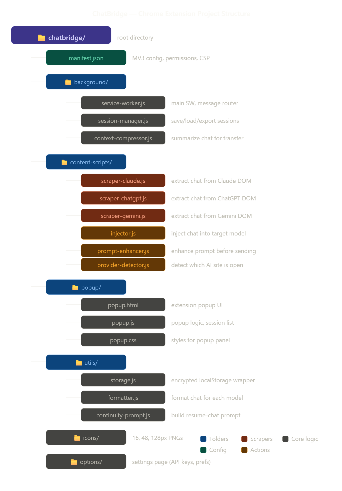
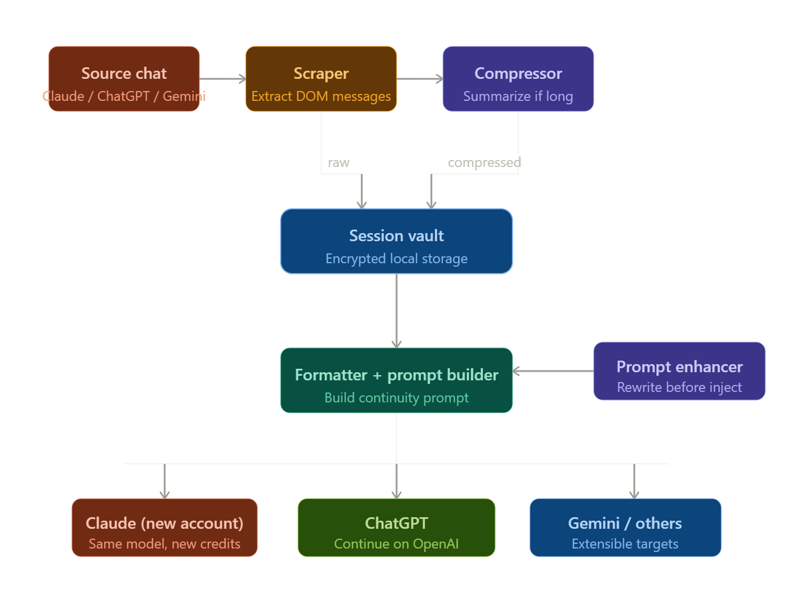

# ⚡ ChatBridge

> **Continue your AI conversations across accounts and models — seamlessly.**

ChatBridge is a Chrome extension that lets you capture any chat from Claude, ChatGPT, or Gemini and continue it on a different account or a completely different AI model — right from where you left off. It also includes a built-in prompt enhancer to supercharge your prompts before sending.

---

## 📌 Table of Contents

- [Why ChatBridge?](#-why-chatbridge)
- [Features](#-features)
- [How It Works](#-how-it-works)
- [Project Structure](#-project-structure)
- [Installation](#-installation)
- [Usage Guide](#-usage-guide)
- [Supported Platforms](#-supported-platforms)
- [Configuration](#-configuration)
- [Development Guide](#-development-guide)
- [Troubleshooting](#-troubleshooting)
- [Roadmap](#-roadmap)
- [Contributing](#-contributing)
- [License](#-license)

---

## 🤔 Why ChatBridge?

Ever hit your Claude usage limit in the middle of an important conversation? Or wished you could continue a ChatGPT chat in Gemini without losing all the context? That's exactly what ChatBridge solves.

**The problem:** AI platforms don't let you export chats and resume them on another account or model. When your credits run out, your context is gone.

**The solution:** ChatBridge reads the chat directly from the page, saves it locally, and injects a perfectly formatted continuity prompt into any target model — so the new AI knows exactly what was discussed and picks up naturally.

---

## ✨ Features

| Feature | Description |
|---|---|
| **Cross-account transfer** | Continue a Claude chat on a new Claude account when credits run out |
| **Cross-model transfer** | Move from Claude → ChatGPT → Gemini or any combination |
| **Smart context compression** | Automatically summarizes long chats to avoid token overload |
| **Session vault** | All captured chats saved locally with encrypted storage |
| **Prompt enhancer** | Rewrite prompts to be clearer, more detailed, structured, or concise |
| **Provider auto-detection** | Automatically detects which AI platform you're currently on |
| **Continuity prompt builder** | Crafts the perfect "resume this chat" prompt for the target model |
| **No API keys required** | Works entirely by reading and writing the page DOM — no external calls |

---

## ⚙️ How It Works

```
Source chat (Claude / ChatGPT / Gemini)
        ↓
   DOM Scraper  ←── Reads messages directly from the page
        ↓
  Context Compressor  ←── Summarizes if chat is very long
        ↓
   Session Vault  ←── Saved to encrypted local storage
        ↓
 Continuity Prompt Builder  ←── Formats for target model
        ↓
      Injector  ←── Pastes prompt into target model's input
        ↓
Target model (New account / ChatGPT / Gemini / etc.)
```

No data ever leaves your browser. Everything is stored locally using `chrome.storage.local`.

---

## 📁 Project Structure




---





## 🚀 Installation

### Load as an unpacked extension (Developer Mode)

1. **Clone or download** this repository:
   ```bash
   git clone https://github.com/yourusername/chatbridge.git
   cd chatbridge
   ```

2. Open **Chrome** and navigate to:
   ```
   chrome://extensions
   ```

3. Enable **Developer mode** using the toggle in the top-right corner.

4. Click **"Load unpacked"** and select the `chatbridge/` folder.

5. The ChatBridge icon (⚡) will appear in your Chrome toolbar. Pin it for easy access.

> **Note:** You do not need to install any npm packages or run a build step. This extension runs as plain JavaScript — just load and go.

---

## 📖 Usage Guide

### 1. Capture a Chat

1. Open any chat on **Claude**, **ChatGPT**, or **Gemini**
2. Click the **⚡ ChatBridge** icon in the toolbar
3. The popup will auto-detect the current platform (shown as a badge at the top)
4. Optionally check **"Compress long chats"** if the conversation is very long
5. Click **📸 Capture Chat**
6. A success message confirms how many messages were saved

### 2. Transfer to Another Account or Model

1. Click the **Sessions** tab in the popup
2. You'll see all your saved sessions listed with the source platform, message count, and date
3. Use the **"Transfer to..."** dropdown to choose your target:
   - `Claude (new account)` — same model, fresh credits
   - `ChatGPT` — continue on OpenAI
   - `Gemini` — continue on Google
4. Click **🚀 Transfer**
5. A new tab opens with the target platform
6. ChatBridge automatically injects the full continuity prompt into the input box
7. Review the prompt if you want, then hit **Send** — the new AI will read the full history and continue the conversation

### 3. Enhance a Prompt

1. Click the **Enhance** tab in the popup
2. Paste your rough prompt into the text area
3. Choose an enhancement mode:
   - **Make clearer** — removes ambiguity, makes intent explicit
   - **Add more detail** — expands with context and specifics
   - **Make structured** — adds clear objective, context, and output format
   - **Make concise** — shortens while keeping all key information
4. Click **✨ Enhance Prompt**
5. Copy the enhanced version with **📋 Copy**

---

🌐 Supported Platforms
PlatformURLCaptureInjectStatusClaudeclaude.ai✅✅SupportedChatGPTchat.openai.com / chatgpt.com✅✅SupportedGeminigemini.google.com✅✅SupportedGroqgroq.com✅✅SupportedDeepSeekchat.deepseek.com✅✅SupportedPerplexityperplexity.ai✅✅SupportedMistral (Le Chat)chat.mistral.ai✅✅SupportedGrokgrok.com / x.com/i/grok✅✅SupportedCohere (Coral)coral.cohere.com✅✅SupportedMeta AImeta.ai✅✅SupportedMicrosoft Copilotcopilot.microsoft.com✅✅SupportedPoepoe.com✅✅SupportedHuggingChathuggingface.co/chat🔜🔜RoadmapPhindphind.com🔜🔜RoadmapYou.comyou.com🔜🔜RoadmapKimi (Moonshot)kimi.moonshot.cn🔜🔜Roadmap

Note: DOM selectors may occasionally break when a platform updates its UI. See Updating DOM Selectors if a scraper stops working.

---

## 🔧 Configuration

Open **Settings** by clicking the ⚙️ icon in the popup, or go to:
```
chrome://extensions → ChatBridge → Details → Extension options
```

| Setting | Default | Description |
|---|---|---|
| Compression threshold | 20 messages | Sessions longer than this are compressed before saving |
| Auto-submit after injection | Off | If enabled, automatically sends the continuity prompt without review |
| Session retention | 30 days | Sessions older than this are automatically deleted |

---

## 🛠️ Development Guide

### Prerequisites

- Google Chrome 100+
- Basic knowledge of Chrome Extension APIs (MV3)
- No build tools required — pure vanilla JS

### Key Files to Know

**`background/service-worker.js`**
The central hub. All messages between the popup and content scripts pass through here. Also handles session CRUD operations.

**`content-scripts/scraper-*.js`**
One scraper per platform. Each reads the DOM and returns a normalized `session` object:
```javascript
{
  provider: 'claude',        // which platform
  url: 'https://...',        // original chat URL
  title: 'Chat title',       // page title
  messages: [
    { role: 'user', content: '...' },
    { role: 'assistant', content: '...' }
  ],
  capturedAt: '2025-01-01T00:00:00Z'
}
```

**`content-scripts/injector.js`**
Handles finding the correct input element on any supported platform and setting its value in a way React/Vue frameworks actually detect (using native input event dispatching).

**`utils/continuity-prompt.js`**
Builds the "resume this chat" prompt. The format looks like:
```
I was having a conversation with Claude (Anthropic) and I need to continue it here.
Please read the conversation history below...

--- CONVERSATION HISTORY ---
USER: ...
ASSISTANT: ...
--- END OF HISTORY ---

Please acknowledge that you've read the above and continue the conversation.
```

### Adding a New AI Platform

To add support for a new platform (e.g. Perplexity):

1. **Create a scraper** — copy `scraper-claude.js` as `scraper-perplexity.js` and update the DOM selectors:
   ```javascript
   window.__chatbridge.scrapeChat = function() {
     // Update these selectors by inspecting the target site's DOM
     const turns = document.querySelectorAll('.YOUR_SELECTOR_HERE');
     // ...
   }
   ```

2. **Update `manifest.json`** — add the new host to `host_permissions` and add a new entry in `content_scripts`:
   ```json
   {
     "matches": ["https://www.perplexity.ai/*"],
     "js": ["content-scripts/provider-detector.js", "content-scripts/scraper-perplexity.js", "content-scripts/injector.js", "content-scripts/prompt-enhancer.js"]
   }
   ```

3. **Update `injector.js`** — add the input and submit button selectors for the new platform:
   ```javascript
   const INPUT_SELECTORS = {
     // ...existing entries...
     perplexity: 'textarea.YOUR_INPUT_SELECTOR'
   };
   ```

4. **Update `provider-detector.js`** — add the hostname mapping:
   ```javascript
   const PROVIDERS = {
     // ...existing entries...
     'www.perplexity.ai': 'perplexity'
   };
   ```

5. **Update `popup.js`** — add the platform to the transfer dropdown and the URL mapping.

### Updating DOM Selectors

AI platforms update their UI regularly, which can break scrapers. When a scraper stops working:

1. Open the target site in Chrome
2. Right-click on a chat message → **Inspect**
3. Find the repeating container element for each turn
4. Update the selector in the relevant `scraper-*.js` file

The scrapers include fallback selector logic to handle minor UI changes gracefully.

---

## 🐛 Troubleshooting

**"No AI detected" badge in popup**
You're not on a supported AI platform tab. Navigate to claude.ai, chatgpt.com, or gemini.google.com first.

**"Scrape failed" error**
The platform may have updated its DOM. Open DevTools on the AI site, inspect the chat messages, and update the selectors in the relevant `scraper-*.js` file.

**Prompt was injected but the input looks empty**
Some platforms use React-controlled inputs. The injector uses native input event dispatching to trigger React state updates — but if it fails, try manually clicking the input box once before transferring.

**Sessions not persisting after browser restart**
Chrome's `storage.local` persists across restarts by default. If sessions are disappearing, check that the extension has the `storage` permission in `manifest.json`.

**Extension not loading ("Could not load manifest")**
Ensure your `manifest.json` is valid JSON with no trailing commas. Use a JSON validator if unsure.

---

## 🗺️ Roadmap

- [ ] Support for Perplexity, Mistral (Le Chat), Grok
- [ ] Cloud sync via optional lightweight backend (sessions across devices)
- [ ] AI-powered compression using the Anthropic API to summarize mid-sections
- [ ] One-click "quick transfer" shortcut key
- [ ] Session search and tagging
- [ ] Export sessions as `.md` or `.json` files
- [ ] Firefox version (WebExtensions API port)
- [ ] Sidebar panel instead of popup for larger session management UI

---

## 🤝 Contributing

Contributions are welcome! Here's how to get started:

1. Fork the repo
2. Create a feature branch: `git checkout -b feature/add-perplexity-support`
3. Make your changes
4. Test by loading the unpacked extension in Chrome
5. Submit a pull request with a clear description of what you changed and why

Please keep PRs focused — one feature or fix per PR makes review much easier.

---

## 📄 License

MIT License — see [LICENSE](LICENSE) for details.

---

## ⚠️ Disclaimer

ChatBridge reads chat content directly from the DOM of AI platforms. It does not store any data on external servers — everything stays in your browser's local storage. This extension is not affiliated with Anthropic, OpenAI, or Google. Use responsibly and in accordance with each platform's terms of service.

---

<p align="center">Built with ⚡ — no vendor lock-in, no credit limits, no lost context.</p>